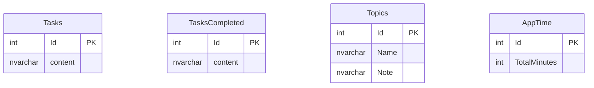
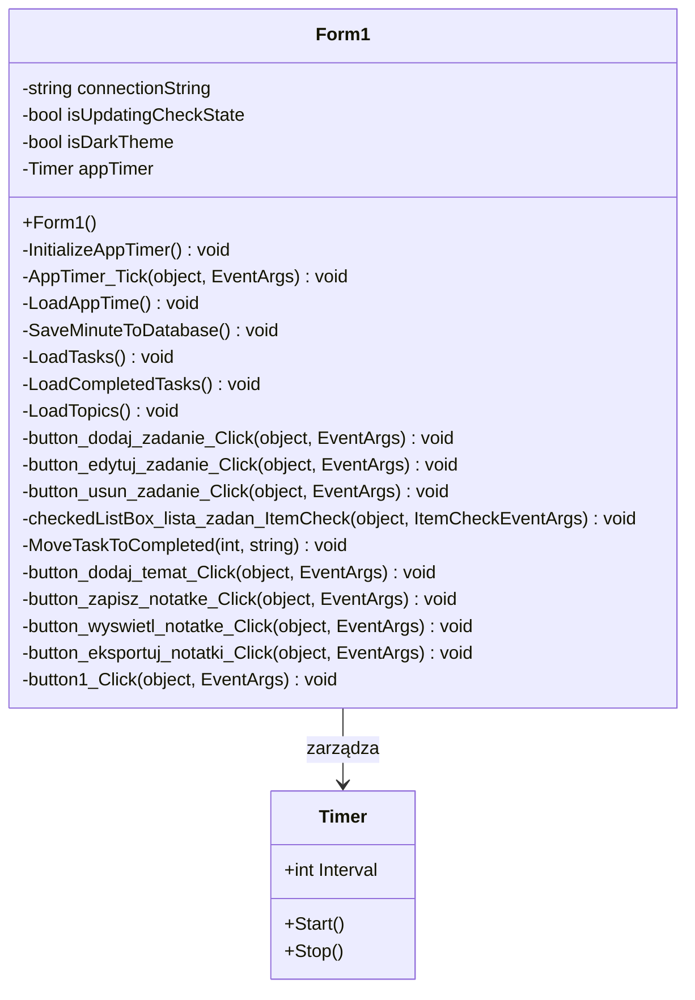

# SmartDesk – Dokumentacja Projektowa i Instrukcja Obsługi

Inteligentny pulpit ucznia i narzędzie wspomagające organizację nauki, zarządzanie zadaniami oraz prowadzenie notatek, zrealizowany w technologii C# .NET Framework (Windows Forms) z bazą Microsoft SQL Server LocalDB.

---

## Spis treści

1. [Informacje ogólne](#1-informacje-ogólne)
2. [Cel i zakres funkcjonalny](#2-cel-i-zakres-funkcjonalny)
3. [Wymagania systemowe i architektura](#3-wymagania-systemowe-i-architektura)
4. [Model danych (Baza SQL)](#4-model-danych-baza-sql)
5. [Diagram klas i struktura kodu](#5-diagram-klas-i-struktura-kodu)
6. [Mechanizmy niezawodności i bezpieczeństwa danych](#6-mechanizmy-niezawodności-i-bezpieczeństwa-danych)
7. [Scenariusze testowe](#7-scenariusze-testowe)
8. [Instrukcja kompilacji i uruchomienia](#8-instrukcja-kompilacji-i-uruchomienia)
9. [Instrukcja użytkownika (Obsługa aplikacji)](#9-instrukcja-użytkownika-obsługa-aplikacji)
10. [Diagnostyka i rozwiązywanie problemów](#10-diagnostyka-i-rozwiązywanie-problemów)

---

## 1. Informacje ogólne

* **Nazwa projektu:** Inteligentny pulpit ucznia (SmartDesk)
* **Autor:** Szymon Elendt
* **Platforma docelowa:** .NET Framework / Windows Forms
* **Język programowania:** C#
* **Licencja:** MIT

---

## 2. Cel i zakres funkcjonalny

### Cel

System ma na celu zapewnienie uczniom i studentom scentralizowanego, lekkiego środowiska desktopowego do codziennej organizacji nauki, eliminując potrzebę korzystania z rozproszonych plików tekstowych i tradycyjnych notatników papierowych.

### Główne moduły

* **Panel zadań (To-Do List):** Dodawanie, edycja oraz usuwanie zadań do wykonania z walidacją długości tekstu.
* **Moduł archiwum zadań zakończonych:** Automatyczne przenoszenie odznaczonych zadań do listy historii z jednoczesnym zliczaniem ogólnej liczby wykonanych zadań.
* **Moduł nauki i notatek (Topics & Notes):** Zarządzanie tematami, edycja obszernych notatek, ich podgląd w dedykowanym oknie modalnym oraz eksport całej bazy wiedzy do pliku tekstowego `.txt`.
* **Panel statystyk i czasu:** Wbudowany minutnik zliczający czas spędzony z uruchomioną aplikacją, zapisywany trwale w bazie danych w formacie godzinowym (`HH:mm`).
* **Personalizacja interfejsu (Motywy):** Przełączanie między motywem jasnym a nowoczesnym motywem ciemnym (Dark Theme) z zachowaniem czytelności kontrolek.

---

## 3. Wymagania systemowe i architektura

### Wymagania systemowe

* **System operacyjny:** Windows 10 lub Windows 11 (64-bit).
* **Środowisko:** .NET Framework.
* **Silnik bazy danych:** Microsoft SQL Server Express LocalDB (`(LocalDB)\MSSQLLocalDB`).
* **Pamięć RAM:** min. 1 GB.
* **Miejsce na dysku:** ok. 30 MB wolnej przestrzeni.

### Architektura aplikacji

Aplikacja została oparta na architekturze warstwowej Windows Forms zawartej w strukturze pliku projektu `SmartDesk.csproj` oraz pliku formularza `Form1.cs`:

* **Warstwa prezentacji (UI):** Formularz główny (`Form1.cs`, `Form1.Designer.cs`) oraz dynamicznie generowane okna podglądu notatek z obsługą podwójnego buforowania grafiki.
* **Warstwa logiki biznesowej:** Obsługa asynchronicznych powiadomień stanu interfejsu (`Task.Delay`), kontrola zapętlania zdarzeń `ItemCheck` oraz mechanizmy automatycznego odświeżania widoków danych.
* **Warstwa dostępu do danych (DAL):** Połączenia z plikiem bazy danych `SmartDesk_DB.mdf` za pośrednictwem obiektów ADO.NET (`SqlConnection`, `SqlCommand`, `SqlDataAdapter`) oraz schematu danych `SmartDesk_DBDS.xsd` z jawnym typowaniem parametrów `SqlDbType.NVarChar`.

---

## 4. Model danych (Baza SQL)

Baza `SmartDesk_DB.mdf` przechowuje informacje w czterech autonomicznych tabelach odpowiedzialnych za zadania bieżące, historię, tematy notatek oraz czas pracy systemu.

---

## 5. Diagram klas i struktura kodu

Poniżej przedstawiono uproszczony diagram klas głównego formularza aplikacji:

---

## 6. Mechanizmy niezawodności i bezpieczeństwa danych

1. **Pełna obsługa standardu Unicode (polskie znaki):**
   Wszystkie operacje zapisu i odczytu wykorzystują typ kolumn `NVARCHAR` w bazie danych, kodowanie `UTF-8` przy eksporcie plików tekstowych oraz jawne parametry `SqlDbType.NVarChar` w zapytaniach SQL. Eliminuje to problemy z nieprawidłowym wyświetlaniem polskich znaków. Konfiguracja kolumn wykorzystuje `COLLATE Polish_CI_AS`.

2. **Ochrona przed zapętlaniem zdarzeń interfejsu (`isUpdatingCheckState`):**
   Podczas programowego odznaczania lub ładowania elementów do `CheckedListBox` zmienna flagowa blokuje wywoływanie zdarzenia `ItemCheck`, zapobiegając błędom logicznym i nieskończonym rekurencjom.

3. **Precyzyjna detekcja kliknięcia checkboxa:**
   Zdarzenie zaznaczenia zadania analizuje współrzędne kursora myszy (`PointToClient` oraz `GetItemRectangle`), dzięki czemu kliknięcie w sam tekst zadania służy jedynie do edycji i wyboru indeksu, a ukończenie zadania następuje wyłącznie po kliknięciu w kwadracik wyboru.

4. **Bezpieczna asynchroniczna informacja zwrotna:**
   Przycisk zapisu notatki informuje o statusie operacji poprzez tymczasową zmianę etykiety na **„ZAPISANO!”** i zielone podświetlenie przy użyciu `await Task.Delay(1500)`, bez blokowania głównego wątku interfejsu (UI Thread).

---

## 7. Scenariusze testowe

| **Nr** | **Zakres testu**        | **Działanie testowe**                                                  | **Oczekiwany wynik**                                                           |
| ------ | ----------------------- | ---------------------------------------------------------------------- | ------------------------------------------------------------------------------ |
| **T1** | Walidacja treści        | Wpisanie zadania o długości mniejszej niż 3 znaki i kliknięcie „Dodaj” | Wyświetlenie ostrzeżenia walidacyjnego, brak zapisu w bazie                    |
| **T2** | Obsługa polskich znaków | Dodanie zadania lub notatki zawierającej znaki typu *ą, ę, ś, ż, ź*    | Poprawny zapis i odczyt znaków bez utraty danych                               |
| **T3** | Selektywne zaznaczanie  | Kliknięcie w tekst zadania na liście                                   | Wpisanie treści zadania do pola edycji bez oznaczania jako ukończone           |
| **T4** | Ukończenie zadania      | Kliknięcie bezpośrednio w kwadracik checkboxa zadania                  | Przeniesienie pozycji do historii (`TasksCompleted`) i inkrementacja statystyk |
| **T5** | Przełączanie motywów    | Kliknięcie przycisku „ZMIEŃ MOTYW”                                     | Płynna zmiana kolorystyki okien, paneli i pól tekstowych (jasny/ciemny)        |
| **T6** | Eksport danych          | Kliknięcie „EKSPORTUJ NOTATKI” i wskazanie pliku docelowego            | Pomyślny zapis wszystkich tematów i notatek w pliku `.txt` z kodowaniem UTF-8  |

---

## 8. Instrukcja kompilacji i uruchomienia

### Wymagania wstępne

* Zainstalowane środowisko **Visual Studio 2019 lub 2022** z zainstalowanym pakietem programistycznym pulpitów Windows (`.NET desktop development`).
* Skonfigurowana instancja **SQL Server Express LocalDB**.

### Kroki uruchomienia

1. Sklonuj repozytorium lub pobierz paczkę źródłową projektu ze struktury pliku `SmartDesk.slnx`.
2. Otwórz plik rozwiązania `SmartDesk.sln` w programie Visual Studio.
3. W oknie **Solution Explorer** kliknij plik bazy `SmartDesk_DB.mdf` i upewnij się, że właściwość **Kopiuj do katalogu wyjściowego** (*Copy to Output Directory*) ustawiona jest na **Kopiuj, jeśli nowszy** (*Copy if newer*).
4. Zbuduj projekt skrótem klawiszowym `Ctrl + Shift + B`.
5. Uruchom aplikację, naciskając klawisz `F5` (**Start**).

---

## 9. Instrukcja użytkownika (Obsługa aplikacji)

### Obsługa głównych funkcji

#### Panel Zadań

* **Dodawanie:** Wpisz treść zadania w polu tekstowym (minimum 3 znaki) i kliknij przycisk **DODAJ ZADANIE**.
* **Edycja:** Kliknij wybrane zadanie na liście, zmień jego treść w polu edycyjnym i kliknij **EDYTUJ**.
* **Ukończenie:** Kliknij bezpośrednio w kwadracik wyboru (checkbox) przy zadaniu – zostanie ono automatycznie przeniesione do dolnej listy zakończonych zadań.
* **Usuwanie:** Zaznacz checkboxy przy zadaniach do skasowania i kliknij przycisk **USUŃ**, a następnie potwierdź operację w oknie dialogowym.

#### Moduł Nauki i Notatek

* **Dodawanie tematu:** Wpisz nazwę nowego przedmiotu lub zagadnienia w sekcji *Nauka* i kliknij **DODAJ TEMAT**.
* **Edycja i zapis notatki:** Wybierz temat z listy rozwijanej (`ComboBox`), wprowadź treść w dużym polu tekstowym i kliknij **ZAPISZ**. Przycisk na chwilę zmieni stan na **ZAPISANO!**.
* **Podgląd w osobnym oknie:** Kliknij przycisk **WYŚWIETL**, aby otworzyć okno dialogowe z nagłówkiem `TEMAT: {nazwa}` oraz pełną treścią notatki.
* **Eksport do pliku:** Kliknij przycisk **EKSPORTUJ NOTATKI**, wybierz lokalizację na dysku i zapisz wszystkie wpisy jako plik tekstowy `.txt`.

#### Statystyki i Motyw

* Panel boczny **STATYSTYKI** na bieżąco prezentuje całkowity czas nauki, aktualizowany co minutę, oraz liczbę ukończonych zadań.
* Przycisk **ZMIEŃ MOTYW** w prawym górnym rogu pozwala w dowolnym momencie przełączać między trybem jasnym a ciemnym.

---

## 10. Diagnostyka i rozwiązywanie problemów

| **Objaw / Komunikat**                                                  | **Możliwa przyczyna**                                                      | **Rozwiązanie**                                                                                                       |
| ---------------------------------------------------------------------- | -------------------------------------------------------------------------- | --------------------------------------------------------------------------------------------------------------------- |
| Polskie litery zamieniają się w znaki zapytania (`?`)                  | Kolumny w bazie danych posiadają stary typ `VARCHAR` zamiast `NVARCHAR`    | Uruchom w bazie skrypt zmieniający typ kolumn na `NVARCHAR(MAX)` z kodowaniem `COLLATE Polish_CI_AS`.                 |
| Zapisane zadania lub notatki znikają po ponownym uruchomieniu programu | Właściwość pliku bazy `.mdf` ustawiona na „Kopiuj zawsze” (*Copy always*)  | W oknie właściwości pliku `SmartDesk_DB.mdf` w Visual Studio zmień **Copy to Output Directory** na **Copy if newer**. |
| Błąd blokady pliku bazy danych podczas startu                          | Baza danych jest otwarta w tle przez projektant SQL Server Object Explorer | Zamknij aktywne okna podglądu danych w Visual Studio i zrestartuj debugowanie.                                        |

---

